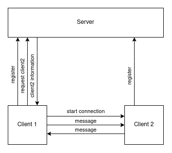

# Infrastructure
In this document, the infrastructure of the peer-to-peer chat application will be explained more in-depth.

## Server - client
As this is a peer-to-peer chat application, we don't need a server for chatting.
This project does have a server, but it is used to store client's ip-addresses, linked to a username.
This way people can easily connect to another client, by just specifying a username.

Here a diagram to explain the connection between both the server and client applications:  

As you can see clients can register themselves to the server, they would provide the server with: **username, password and ip-address**.
The server then saves their information for future use.
Whenever a client wants to start a peer-to-peer connection to another client, they can simply request their information from the server, given a username.

After the client has gotten the other client's information (**ip-address**), it can start a peer-to-peer connection.
