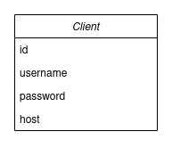

# Models
In this document all the models of entities used in the application will be explained.

As this is a pretty small project, especially the features of the server, there is only one Entity model.

## Client
As the only thing the server is responsible for is providing a client list, and registering clients, this is the only model needed.
Here a class diagram:

As PK, there's an id, generated by `sqlalchemy`. Besides that, the only parameters needed are `username`, `password` and `host`.